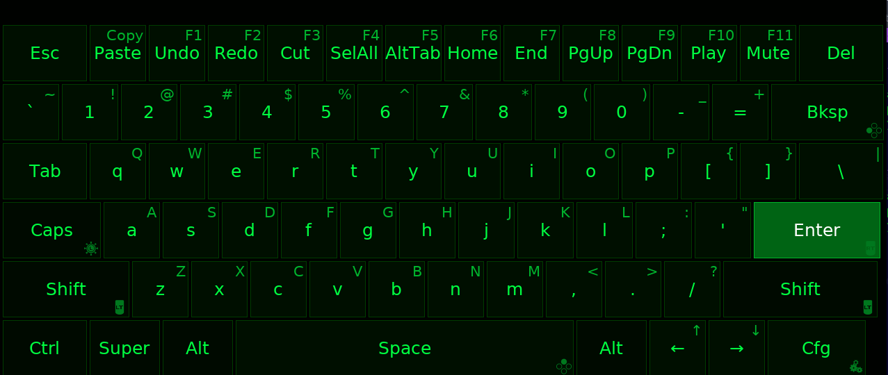
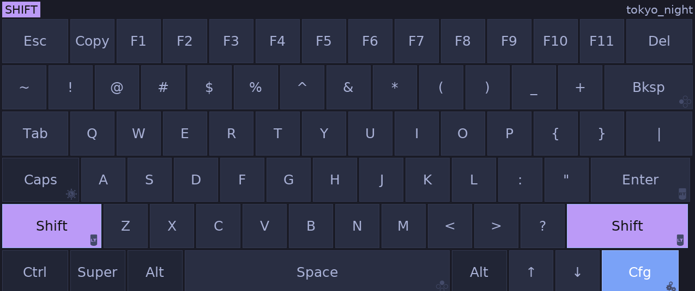

# gamepad-osk

Gamepad-controlled on-screen keyboard for Linux. Designed for couch gaming, Sunshine/Moonlight streaming, and any setup where you need to type with a controller.

No Steam dependency. Works on X11 and Wayland (key injection via uinput).



## Features

- Full QWERTY keyboard with shortcuts row (Undo, Redo, Cut, Select All, Alt+Tab, etc.)
- SDL2 GameController for normalized input (works with any controller)
- Xbox 360 pad auto-detection (swap_xy quirk handled automatically)
- 60 color themes (cycle live with Cfg key, or set via config/flag)
- Promptfont controller-agnostic button glyphs on mapped keys
- Mouse cursor via right stick + R3/RB click (hold to drag)
- Key repeat on hold (configurable delay and rate)
- Shift layer, Caps Lock, accent popup (Shift + hold on vowels)
- Paste/Copy key, media keys (Play/Pause, Mute)
- Always-on-top, no focus stealing (types into whatever app has focus)
- Multi-monitor aware (positions on primary monitor)
- Configurable: buttons, sticks, theme, scale, position, opacity, deadzone
- IPC toggle via Unix socket (`gamepad-osk --toggle`) for evsieve/hotkey integration
- Daemon mode for systemd user service
- Single static binary, ~5MB

## Dependencies

**Runtime:** `sdl2` `sdl2_ttf` `ttf-promptfont` (AUR)

**Build:** `go` `sdl2` `sdl2_ttf` `libx11`

## Installation

### AUR (Arch Linux)

```bash
yay -S gamepad-osk-bin   # pre-built binary from GitHub release
yay -S gamepad-osk-git   # build from latest source
```

To auto-update `-git` packages when upstream changes, enable devel checking:

```bash
yay --devel --save
```

### From source

```bash
git clone https://github.com/0x90shell/gamepad-osk.git
cd gamepad-osk
go build -o gamepad-osk .
sudo install -Dm755 gamepad-osk /usr/bin/gamepad-osk
sudo install -Dm644 config.toml /usr/share/gamepad-osk/config.toml
sudo install -Dm644 gamepad-osk.service /usr/lib/systemd/user/gamepad-osk.service
```

## Systemd User Service

AUR packages install the service file automatically. To enable:

```bash
systemctl --user enable --now gamepad-osk
```

Toggle visibility (bind to evsieve or hotkey):

```bash
gamepad-osk --toggle
```

## Usage

```
gamepad-osk                          # start (auto-detect gamepad)
gamepad-osk --device /dev/input/X    # use specific device
gamepad-osk --theme synthwave        # start with theme
gamepad-osk --toggle                 # toggle running instance
gamepad-osk --daemon                 # start hidden, wait for toggle
gamepad-osk --help                   # show all options
```

## Controls

| Input | Action |
|-------|--------|
| Left stick / D-pad | Navigate keyboard |
| Right stick | Move mouse cursor |
| A | Press highlighted key (hold to repeat) |
| B | Close keyboard |
| X | Backspace (hold to repeat) |
| Y | Space (hold to repeat) |
| LT (hold) | Shift |
| RT | Enter (hold to repeat) |
| RB | Left mouse click (hold to drag) |
| LB | Right mouse click |
| Mouse stick click (R3) | Left mouse click |
| Nav stick click (L3) | Caps Lock |
| Start | Toggle keyboard top/bottom |
| Shift (LT) + hold A (on vowel) | Accent popup (é, ñ, ü, etc.) |
| Cfg key | Cycle themes (Shift+Cfg = reverse) |

## Configuration

Config is loaded from (first found):
1. `~/.config/gamepad-osk/config.toml`
2. `/etc/gamepad-osk/config.toml`
3. `config.toml` next to binary
4. `config.toml` in working directory

A default config is auto-copied to `~/.config/gamepad-osk/` on first run.

See `config.toml` for all options including button remapping, mouse stick, theme, scale, opacity, and deadzone.

## Themes

60 built-in themes. Cycle live with the Cfg key on the keyboard.

`ayu_dark` `candy` `catppuccin` `catppuccin_frappe` `cga` `chalk` `cobalt` `copper` `coral` `cyberpunk` `dark` `dracula` `ember` `everforest` `fjord` `forest` `gameboy` `gold` `gotham` `gruvbox` `high_contrast` `horizon` `ice` `kanagawa` `lavender` `material` `matrix` `mellow` `midnight` `monokai` `moss` `navy` `neon` `nightfox` `nord` `ocean` `olive` `onedark` `oxocarbon` `palenight` `paper` `plum` `retro` `rose_pine` `sakura` `sand` `slate` `solarized` `solarized_light` `steam_green` `sunset` `synthwave` `teal` `terminal` `tokyo_night` `tokyo_storm` `vapor` `virtualboy` `wine` `zx_spectrum`

| | | |
|---|---|---|
|  |  |  |
|  |  |  |
|  |  |  |
|  |  |  |
|  |  |  |
|  |  |  |
|  |  |  |
|  |  |  |
|  |  |  |
|  |  |  |

## Evsieve Integration

Example evsieve config to toggle the keyboard with Guide+Start:

```bash
evsieve \
  --input /dev/input/gamepad0 grab \
  --hook key:btn_mode key:btn_start exec-shell="gamepad-osk --toggle" \
  --output
```

## Device Grab

When `grab = true` (default), the gamepad is exclusively grabbed while the keyboard is visible. This prevents controller input from bleeding into the game while you're typing. The grab is released when the keyboard hides.

If using evsieve, set `grab = false` in config and let evsieve handle routing.

## Wayland

The keyboard works on Wayland (input and key injection are kernel-level via evdev/uinput). However, window positioning and always-on-top require compositor-specific rules since Wayland has no universal API for these.

**Hyprland** (`~/.config/hypr/hyprland.conf`):
```
windowrulev2 = float, class:^(gamepad-osk)$
windowrulev2 = pin, class:^(gamepad-osk)$
windowrulev2 = nofocus, class:^(gamepad-osk)$
windowrulev2 = move 50%-w/2 100%-h-20, class:^(gamepad-osk)$
```

**Sway** (`~/.config/sway/config`):
```
for_window [app_id="gamepad-osk"] floating enable, sticky enable, move position center, move down 300
```

On Wayland the keyboard may not appear in the exact bottom-center position by default — the compositor rules above handle positioning.

## License

MIT
